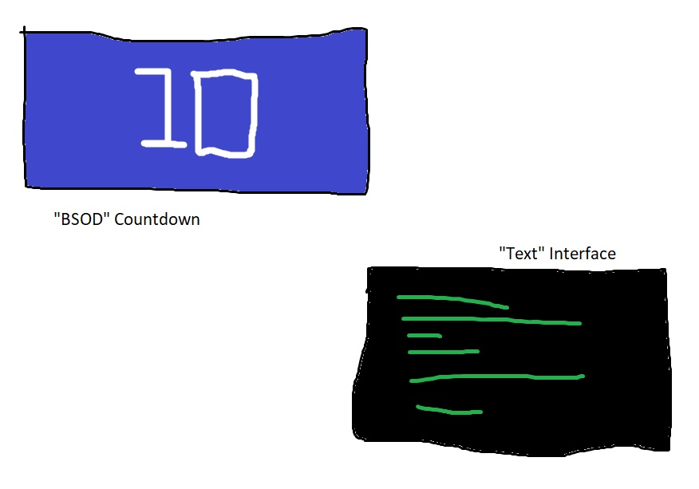

# ReadMe - HW06 Working Document

The text that I've chosen for this assignment is my own summary of John Berger's 1972 video, ***Ways of Seeing*** from this week's *Read & Respond*.

I wanted to bring forth a new dimension to the simple text-based summary, and felt like implementing one of Berger's quotes practically; about how the addition of music and rhythm can bring about subtle modifications to the meaning / feelings of paintings & art.

Additionally, I wanted the text appearing on screen to react dynamically to my own comments made in the summary. Hence, I coded in the functionality to change the sentence color to *yellow* whenever it detected my personal comment.

For this assignment, I already had the music and a rough idea in my mind. I jotted them down in the form of a digital sketch using Paint.

I wanted the whole assignment to have a "tech-y" feel, hence I chose the colors and the fonts accordingly: system-based blue & green hues along with square-ish & mono-spaced typefaces.

I primarily faced ***two*** challenges while implementing this. The first challenge was to get the countdown working properly with each passing second. I've used an *array* to store the countdown numbers, and was utilizing the *second()* function initially to traverse through the array elements. However, this wasn't working properly as *second()* returns the current seconds value of the system clock, due to which my countdown was starting from a different number everytime. I ultimately implemented my own timer using *millis()*, and incrementing that value by 1000 to get the correct sequence.

The second challenge was the music. I had edited the music using *FL Studio* to keep only the desired portions and the "drop", but wanted to have a fade-in effect at the start. I tried using the *setVolume()* function to pass the *amplitude* and *ramp* values but it wasn't working. Moreover, to get this function working, inclusion of the ***p5.sound*** library was required which I wasn't able to figure out. Hence, I edited the audio file directly by creating a fade-in automation using *FL Studio*.